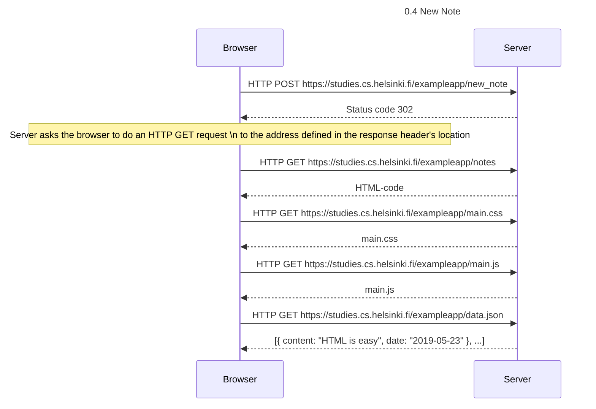

```mermaid
sequenceDiagram
    title 0.4 New Note

    participant Browser
    participant Server

    Browser->>Server: HTTP POST https://studies.cs.helsinki.fi/exampleapp/new_note
    Server-->>Browser: Status code 302
    Note over Browser: Server asks the browser to do an HTTP GET request \n to the address defined in the response header's location

    Browser->>Server: HTTP GET https://studies.cs.helsinki.fi/exampleapp/notes
    Server-->>Browser: HTML-code
    Browser->>Server: HTTP GET https://studies.cs.helsinki.fi/exampleapp/main.css
    Server-->>Browser: main.css
    Browser->>Server: HTTP GET https://studies.cs.helsinki.fi/exampleapp/main.js
    Server-->>Browser: main.js

    Browser->>Server: HTTP GET https://studies.cs.helsinki.fi/exampleapp/data.json
    Server-->>Browser: [{ content: "HTML is easy", date: "2019-05-23" }, ...]
```
